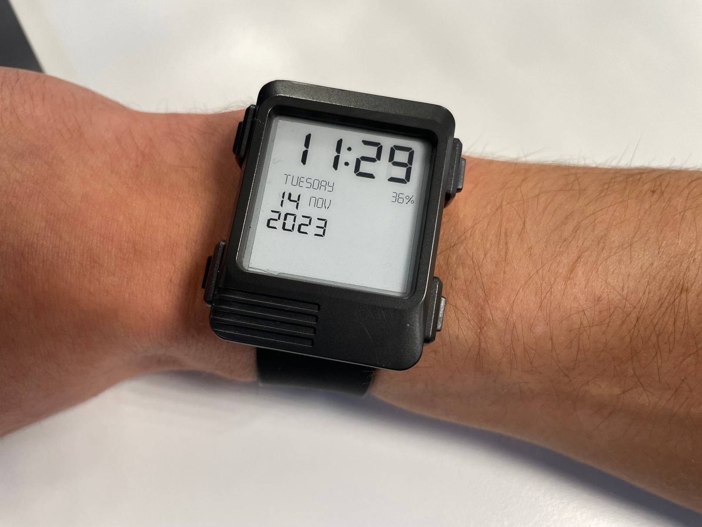

# watchy

This is my fork of [watchy](https://github.com/sqfmi/Watchy)



Due to an overall lack of proper doc and no updates to the OG repo, I've completely changed the hierarchy of the repo to match my specific tweaks and changes. Mainly watchy is no longer a library and the display part is no longer decoupled in another repo. Everything is in `src`. 

Here is a list of features/changes implemented:

- updated espressif32 platform
- Wake up alarm (Will buzz at a specific time) 
- sleep/standby mode for the night (icon from [this repo](https://github.com/LeonMatthes/WatchyOS))
- removed wifi hotspot/OTA/NTP/steps counter functionnalities
- time sync using [the worldtimeapi](http://worldtimeapi.org/) to account for DST and timezones automatically

This results in a battery life of around 15-20 days. Depending on the frequency of time syncs (if you're not overly concerned by a few minutes of clock drift over a month), I've managed a whole month on a single charge.


## how to build

clone the repo
```
git clone
cd
```

setup the python env for platformio

```
python3 -m venv venv
source venv/bin/activate.fish
pip3 install platformio
```

copy and adjust the settings

```
cp src/settings.example.h src/settings.h
edit src/settings.h
```

build once to download the required framework and dependencies

```
pio run
```

then plug in the watch and upload 

```
pio run -t upload
```